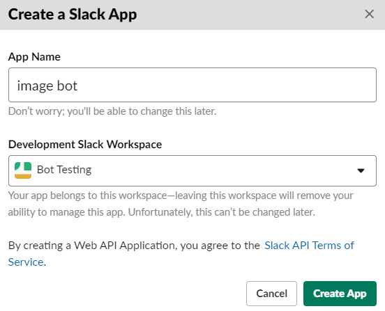
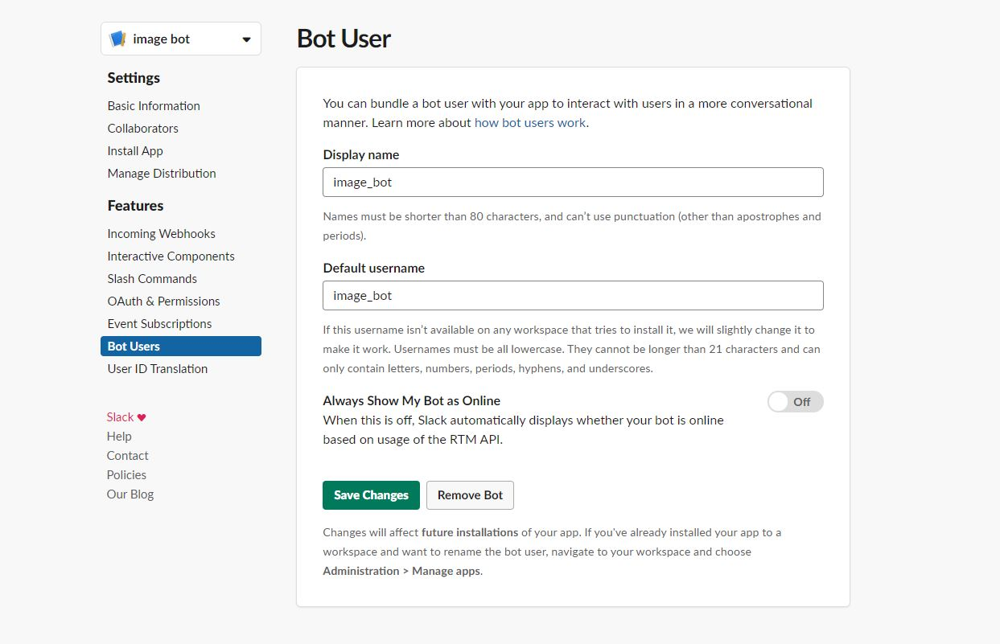
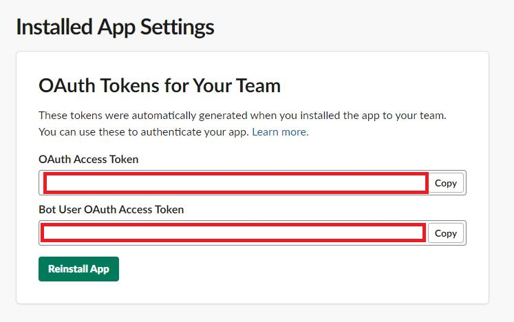
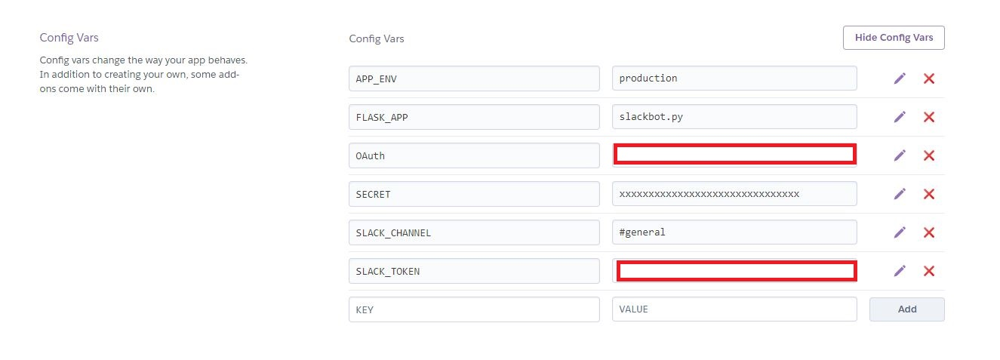
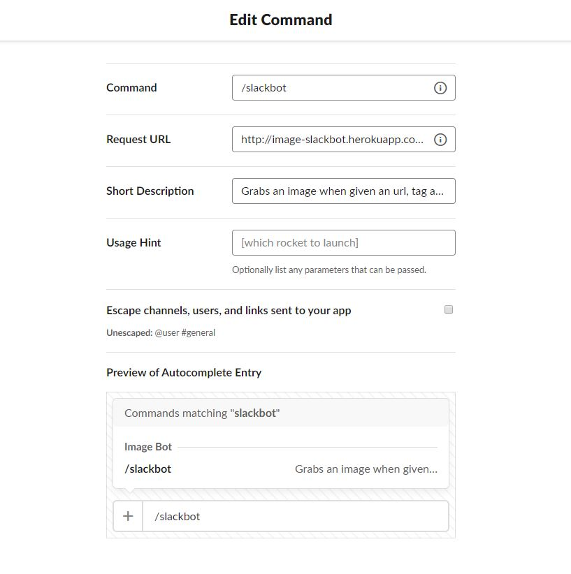

# Image Slackbot

This image slackbot was created as a coding challenge for American Express.

## Introduction

This slackbot can be called in a slack channel and an image can be retrieved given an url, tag and class/id name. It utilizes a Flask server which calls slack APIs and uses beautifulsoup to parse a website.

Thank you to Abdulqahhar Aminujatto for his [article](https://medium.com/the-andela-way/how-to-build-a-task-notification-bot-for-slack-with-python-part-1-333cb50985f4) that taught me how to set up a slackbot with Flask.

## How to Use
To use this slackbot, go to the designated channel and type: /slackbot (url) (tag) (class=xxxxxx)/(id=xxxxxx)
The spacing is important!

## Tecnologies
* Flask
* Beautiful Soup
* Slack API

## Installation

To install this slackbot in your own slack channel, follow these instructions:

1. Go to [your apps](https://api.slack.com/apps) on Slack, create a new app, and fill out the requested information.

<br />
<br />

<br />
<br />

2. Click on *Bot Users* under __Features__ and add a new bot user using whatever name and username you desire.

<br />
<br />

<br />
<br />

3. Go to *Install App* under __Settings__ and install the app under your slack workspace. Record the OAuth Access token and Bot User OAuth Access token.

<br />
<br />

<br />
<br />

4. Create a Heroku account if you don't have one already, install the Heroku Toolbelt CLI and use ```heroku login``` to login to the heroku CLI

5. Fork this repo to have your own clone of the code. Create a new git repository with ```git init```, add the new content with ```git add .``` and commit the changes with a message using ```git commit -m "(enter a message of your choice here)"```

6. Create a new heroku app by using ```heroku create [appname]```

7. Login to your heroku dashboard, select this project, and go to settings. Click on __Reveal Config Vars__ and add the following key-value pairs as shown below.

<br />
<br />

<br />
<br />

8. Push the code by runnin ```git push heroku master```. You *may* have to set the heroku remote. The bash command can be found on the app's heroku page under the __Deploy__ tab.

9. Go to the app's page and select *Slash Commands* under __Features__. Select *Create New Command* and fill out the information. The url should look something like: ```http://(your-apps-name).herokuapp.com/image-bot```

<br />
<br />

<br />
<br />


It may take a few minutes for the Heroku app to load. 

The slackbot should now be running on your own workspace! Test it out and grab images from online!

## Examples

Here we use the example given to us in the prompt to find the image using the slackbot
<br />
<br />

<br />
<br />

Another example of the slackbot correctly working to grab Abdulqahhar's image from his medium post
<br />
<br />

<br />
<br />

An example with an input where the img does not exist. Notice that the image-found is returned as *false* to notify the user that the image cannot be found.
<br />
<br />

<br />
<br />

